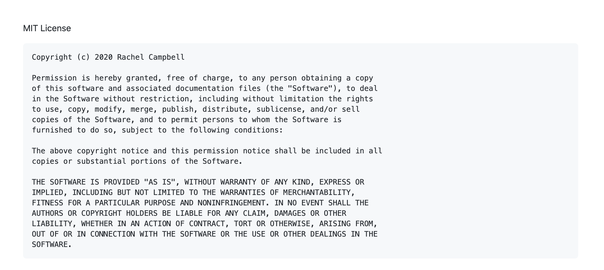

# README Generator

[](https://opensource.org/licenses/MIT)
[](https://GitHub.com/relizabet/README_Generator/issues/) [](https://GitHub.com/relizabet/README_Generator/issues?q=is%3Aissue+is%3Aclosed)

## Description

This is a node.js terminal application that is used to generate README and LICENSE files based on user input.

### User Story

```
AS A developer
I WANT a README generator
SO THAT can quickly create a professional README for a new project
```

### Acceptance Criteria

```md
GIVEN a command-line application that accepts user input
WHEN I am prompted for information about my application repository
THEN a quality, professional README.md is generated with the title of your project and sections entitled Description, Table of Contents, Installation, Usage, License, Contributing, Tests, and Questions

WHEN I enter my project title
THEN this is displayed as the title of the README

WHEN I enter a description, installation instructions, usage information, contribution guidelines, and test instructions
THEN this information is added to the sections of the README entitled Description, Installation, Usage, Contributing, and Tests

WHEN I choose a license for my application from a list of options
THEN a badge for that license is added hear the top of the README and a notice is added to the section of the README entitled License that explains which license the application is covered under

WHEN I enter my GitHub username
THEN this is added to the section of the README entitled Questions, with a link to my GitHub profile

WHEN I enter my email address
THEN this is added to the section of the README entitled Questions, with instructions on how to reach me with additional questions

WHEN I click on the links in the Table of Contents
THEN I am taken to the corresponding section of the README
```

## Table of Contents

- [README Generator](#readme-generator)
  - [Description](#description)
    - [User Story](#user-story)
    - [Acceptance Criteria](#acceptance-criteria)
  - [Table of Contents](#table-of-contents)
  - [Installation](#installation)
  - [Usage](#usage)
  - [License](#license)
  - [Contributing](#contributing)
  - [Testing](#testing)
  - [Contact](#contact)

## Installation

This application is initialized in the terminal with the command `node index.js`.

## Usage

The user is prompted with a series of questions used to fill out the README template. The application will also generate a `.md` file based on what License is chosen by the user.




## License

[MIT](./LICENSE.md)

## Contributing

To contribute to this project create a branch with the feature or correction then submit a pull request.

## Testing

No tests have been created for this application at this time.

## Contact

Please direct any questions or concerns directly to me via my email address listed below.

- Github: [relizabet](https://github.com/relizabet)
- Email: rachel@relizabeth.com
